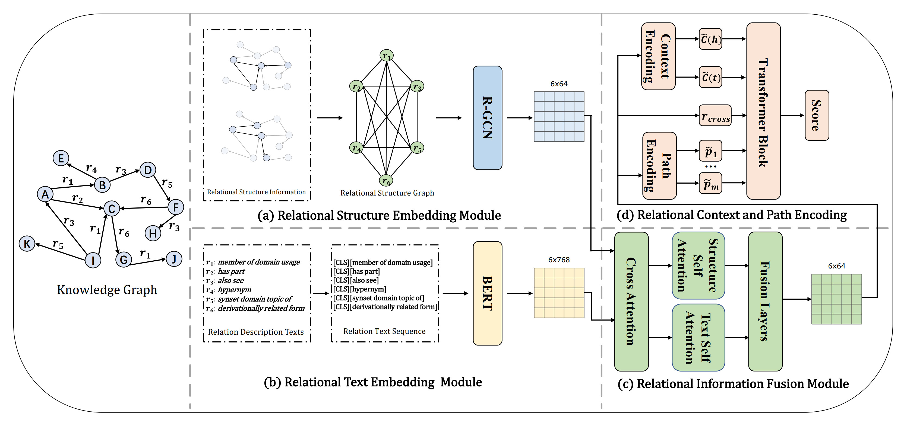

# CASTR

## Abstract
Inductive relation prediction aims to prediction missing relations in a knowledge graph. Most existing models  emphasize logical rules but neglect semantic dependencies between relations. This paper proposes a novel inductive relation model, namely CASTR (Cross-Attention Fusion of Structural and Textual Information of Relation), which uses the main modules of Relational Structure Embedding (RSE) and Relational Text Embedding (RTE). In addition, the cross-attention mechanism is used to effectively fuse the structural and textual information of relation for improving reasoning ability. A hierarchical Transformer Block is designed to adaptively aggregate the relational paths and relational contexts. Experimental results show that CASTR achieves an average improvement of 1.21\% in Hits@10 and 0.75\% in MRR across FB15k-237 and WN18RR datasets, demonstrating consistent superiority over state-of-the-art baselines. Case study shows that it has stronger capability of representation of complex relations in the knowledge graph.

## Model Architecture
The overall framework of CASTR. (a) Relational Structure Embedding Module. (b) Relational Text Embedding Module. (c) Relational Information Fusion Module. (d) Relational Context and Path Encoding.


## Training and Testing

**Step1** Create a virtual environment using ```Anaconda``` and enter it
```bash
conda create -n castr python=3.8
source activate castr
```

**Step2** Install package
```bash
pip install -r requirements.txt
```

**Step3** data processing
```bash
bash scripts/preprocess_data.sh
```

**Step4** run experiments
```bash
bash scripts/train.sh
```

## Baselines
We use code provided by authors for baselines in our experiments.
REPORT is aggregates relational Paths and context with hierarchical Transformers for inductive relation prediction. Detailed instructions can be found [here](https://github.com/JiaangL/REPORT).


## Citation
Please condiser citing this paper if you use the ```code``` from our work.
```

```
